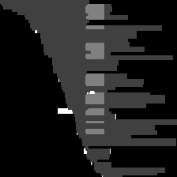
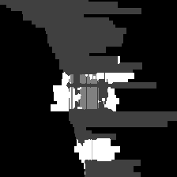

# Module 3 – CNV Image Generation and Benchmarking (HG002 chr22)

## Data & Tools

We analyzed the **GIAB 2025.01 release (PAW70337)** from Oxford Nanopore Technologies  
([Detailed Data & Description Page](https://epi2me.nanoporetech.com/giab-2025.01/)),  
using the **HG002 Ashkenazi Trio son** dataset.  

- **Sample:** HG002 (Ashkenazi Trio son)  
- **Platform:** Oxford Nanopore **sup (super accuracy)** basecalling model  
- **Basecaller:** Dorado v0.8.2  
- **Reference genome:** GRCh38 (no alt analysis set)  
- **Variant callers:**  
  - **Sniffles2 v2.0.7** (SV/CNV detection)  
  - **Spectre v0.2.2** (long-read CNV detection)  
- **Benchmarking:** **Truvari v4.1.0** against the **GIAB HG002 SV truth set v0.6 (GRCh38 no-alt)**  

---

## Image Generation Workflow

Candidate CNVs were converted into image representations for deep learning analysis:

1. **Read extraction:** Reads overlapping ±500 bp of each CNV breakpoint were collected from haplotagged CRAM/BAM files (restricted to chr22).  
2. **CIGAR parsing:** Alignment operations (matches, deletions, insertions, soft-clips) were extracted.  
3. **Image encoding:**  
   - 224×224 grayscale tensors with four channels (M, D, I, S).  
   - Converted into RGB format via grayscale encoding:  
     - Match = 1, Deletion = 2, Insertion = 3, Soft-clip = 4  
     (replicated across RGB channels).  
4. **Output:** RGB images (PNG) for downstream CNN and vision-transformer models.  

---

## Benchmarking Results

From the chr22 subset of HG002, we generated a total of **427 RGB CNV images**:  
- **250 true positives (TPs)** (128 insertions, 122 deletions)  
- **177 false positives (FPs)** (50 insertions, 127 deletions)  

---

## Figures

We highlight representative examples of both true and false positive CNV predictions.  
These illustrate the alignment patterns around CNV loci and the visual separability of signal vs noise.

  
  

  
  

**Figure 1.** Examples of CNV pileup images. Top row: true positives (TP-INS, TP-DEL). Bottom row: false positives (FP-INS, FP-DEL).

---

## Work in Progress – Channel Improvisation (Testing Logic)
To extend beyond the four CIGAR-based channels, we are experimenting with adding **coverage, MAPQ, and strand channels**:

- **Coverage (per-column read depth)**  
  - *Why:* CNVs are fundamentally depth events; depth shifts highlight copy number changes.  
  - *How:* Count reads covering each reference column, normalize 0–255, and broadcast to a square image.  

- **Mapping Quality (MAPQ)**  
  - *Why:* Low-MAPQ piles often occur near repeats and ambiguous regions; useful to down-weight noisy evidence.  
  - *How:* Paint each read’s aligned span with its MAPQ (scaled 0–255, capped at 60).  

- **Strand Orientation**  
  - *Why:* Strand imbalance and orientation flips frequently occur across CNV breakpoints.  
  - *How:* Paint read spans with 255 for reverse-strand, 0 for forward.  

These additions are to enhance the separability of true vs false CNVs. Future extensions may also include mismatch density and GC% tracks.

---

