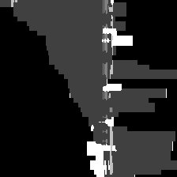
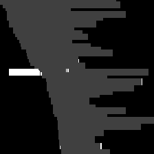

# CNVision

## Contributors
Sina Majidian (👑 Group Lead), Archit Kalra (👑 Group Lead), Philippe Sanio, Muteeba Azhar, Thomas Krannich, Zhihan Zhou, Narges SangaraniPour, Jasmine Baker, Gerald McCollam, Kavya Vaddadi, Jinhao Wang, Fazel Amirvahedi, Hanan Wees

## Introduction
Our goal is to enhance copy number (CNV) calling and filtering using advanced machine learning techniques. We focus on leveraging bidirectional encoder models, such as **DNABERT-2**, to improve the classification of CNV breakpoints from a reference genome, as well as image-based techniques for CNV classification. For instance, Sniffles2 calls for a Genome in a Bottle (GIAB) benchmark dataset can be cross-referenced with CNV breakpoints on the GRCh38 reference genome. These breakpoints can then be used to derive sequences for training models to identify insertions, deletions, inversions, and false positives. We will also incorporate image-based classification of CNVs (using a similar technique to Xia et al. (2024)), utilizing DINOv3: Self-supervised models with downstream multi-class classification pipelines (Siméoni et al., 2025).

## Methods

The benchmarked human genome datasets HG002 and HG008 from the Genome in a Bottle (GIAB) consortium was used. The input data included long-read sequencing datasets generated using PacBio HiFi and Oxford Nanopore ultra-long (ONT-UL) platforms (McDaniel et al., 2025). Reads were aligned against GRCh38 and T2T-CHM13 reference assemblies using standard long read alignment strategies to obtain high-quality BAM files. CNV were called using Sniffles2 (v2.0.7) and Spectre (v0.2.2) which represent state-of-the-art CNV caller optimized for long read sequencing, supplemented with optional third CNV caller for cross validation (De Clercq et al., 2024) (Smolka et al., 2024). Breakpoints from called CNVs were extracted and used as the basis for both sequence-based and image-based downstream analysis. We extracted flanking regions from each predicted CNV breakpoint to capture specific sequence signature. The genomic segments were tokenized and encoded using DNABERT-2, a transformer based language model trained on large scale genomic data. We fine tuned DNABERT-2 embeddings for CNV classification tasks. Training used the GIAB HG002/HG008 benchmark truth sets and clinically validated CNV datasets with a train/test split to enable robust model fine-tuning and evaluation (Consens et al., 2025). 

In parallel with sequence embedding, we generated image-based representations of CNVs from aligned read data. Using CSV-filter and NPSV-deep, we encoded read pileups into tensor-like images that reflect allele balance, sequencing depth and zygosity status (e.g., homozygous reference [0/0] vs heterozygous variant [0/1]) (Xia et al., 2024). The resulting image tensors were processed using DINOv3, a self-supervised vision transformer model developed for large-scale image representation learning. DINOv3 produces latent image embeddings that capture structural features distinguishing true CNVs from sequencing artifacts (Siméoni et al., 2025). As with sequence embeddings, supervised fine-tuning was conducted against GIAB truth sets and clinical CNVs using an identical training/test split strategy. Both the DNABERT-2 (sequence-based) and DINOv3 (image based) models were fine-tumed independently. Outputs were integrated into a filtering framework designed to classify CNV candidates as true or false positives. Finally, a filtering and evaluation framework was implemented to integrate outputs from both models. Model performance was assessed by comparison against truth sets (GIAB and clinical CNVs), false positive reduction efficiency, precision and recall metrics which provide a balanced measure of classification accuracy in CNV detection. This multi model approach, integrating sequence language models with vision transformers provides a robust and scalable framework for accurate CNV detection in long read sequencing data. 


Figure 1. Methods Flowchart. Descriptive flow chart of methodology.  


### Build environment
```
# create and activate virtual python environment
conda create -n dna python=3.8
conda activate dna

# install required packages
pip install -r requirements.txt
pip uninstall triton
````


## Module 1 (data preprocessing)

Downloading data

```
#HG002_sup_PAW70337_based_alignment_and_call_files: 
aws s3 cp s3://ont-open-data/giab_2025.01/analysis/wf-human-variation/sup/HG002/PAW70337/output/SAMPLE.haplotagged.cram   ./ --no-sign-request
aws s3 cp s3://ont-open-data/giab_2025.01/analysis/wf-human-variation/sup/HG002/PAW70337/output/SAMPLE.haplotagged.cram.crai ./ --no-sign-request
echo "done downloading samples-cram files"


#reference fasta - GRCh38
wget ftp://ftp.ncbi.nlm.nih.gov/genomes/all/GCA/000/001/405/GCA_000001405.15_GRCh38/seqs_for_alignment_pipelines.ucsc_ids/GCA_000001405.15_GRCh38_no_alt_analysis_set.fna.gz
echo "done downloading cram specific-fasta file"
gunzip GCA_000001405.15_GRCh38_no_alt_analysis_set.fna.gz 
samtools faidx GCA_000001405.15_GRCh38_no_alt_analysis_set.fna
echo "done indexing fasta"
```


```
# CNV (Spectre)
aws s3 cp s3://ont-open-data/giab_2025.01/analysis/wf-human-variation/sup/HG002/PAW70337/output/SAMPLE.wf_cnv.vcf.gz   ./ --no-sign-request
aws s3 cp s3://ont-open-data/giab_2025.01/analysis/wf-human-variation/sup/HG002/PAW70337/output/SAMPLE.wf_cnv.vcf.gz.tbi ./ --no-sign-request
echo "done downloading Spectre VCF files"
```
(We are generating CNVs from the newest version of software.)


## Module 2 (LLM )

### Scripts for Genome Foundation Model encoding, embedding and fine-tuning

Here are two scripts:
1. encoding_embedding.py that provide examples of using DNABERT-2 (or any similar model like Nucleotide Transformers) to encode and embed DNA sequences.
2. finetune.py that allow finetuning of DNABERT-2 and similar models on a sequence classfication or regression dataset.


```
dna_sequences = ["CAGTACGTACGATCGATCG", "CAGTCAGTCGATCGATCGATCG"]
model_name = "zhihan1996/DNABERT-2-117M"
encoding = encode_sequence(dna_sequences, model_name)
print(encoding)
```


```
python finetune.py \
    --model_name_or_path $model_name \
    --data_path  $data_path \
    --kmer -1 \
    --run_name DNABERT2_run \
    --model_max_length $max_length \
    --per_device_train_batch_size 8 \
    --per_device_eval_batch_size 16 \
    --gradient_accumulation_steps 1 \
    --learning_rate 3e-5 \
    --num_train_epochs 3 \
    --fp16 \
    --save_steps 200 \
    --output_dir output/dnabert2 \
    --evaluation_strategy steps \
    --eval_steps 200 \
    --warmup_ratio 0.1 \
    --logging_steps 100000 \
    --find_unused_parameters False
```


## Module 3 ( Image Encoding)

BAM data preprocess from CSV-Filter
```
python bam2depth.py
```





## Module 4 ( Image Embeddings )

Self-supervised learning for vision at unprecedented scale

https://ai.meta.com/dinov3/


## Relevant Papers
- [Smolka et al., 2024 - Detection of mosaic and population-level structural variants with Sniffles2](https://doi.org/10.1038/s41587-023-02024-y)
- [Xia et al., 2024 - CSV-Filter: a deep learning-based comprehensive structural variant filtering method](https://doi.org/10.1093/bioinformatics/btae539)
- [Zhou et al., 2024 - DNABERT-2: Efficient foundation model and benchmark for multi-species genome](https://iclr.cc/media/iclr-2024/Slides/17823.pdf)
- [Poplin et al., 2018 - A universal SNP and small-indel variant caller using deep neural networks](https://www.nature.com/articles/nbt.4235)
- [Siméoni, O., Vo, H. V., Seitzer, M., Baldassarre, F., Oquab, M., Jose, C., ... & Bojanowski, P. (2025). DINOv3.](https://ai.meta.com/research/publications/dinov3/)


(+ Narges, Zhihan, Jasmine, Gerald)


